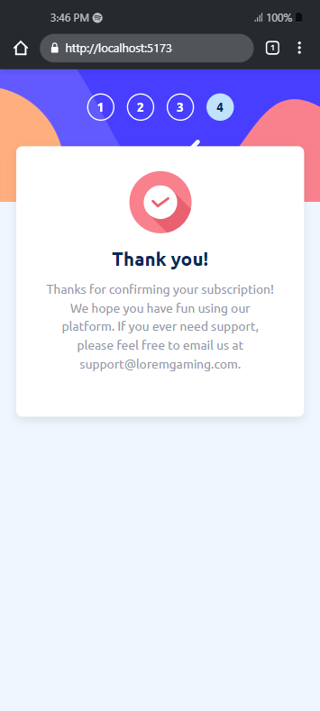

# Frontend Mentor - Multi-step form solution

This is a solution to the [Multi-step form challenge on Frontend Mentor](https://www.frontendmentor.io/challenges/multistep-form-YVAnSdqQBJ). Frontend Mentor challenges help you improve your coding skills by building realistic projects.

## Table of contents

- [Overview](#overview)
  - [The challenge](#the-challenge)
  - [Screenshot](#screenshot)
  - [Links](#links)
- [My process](#my-process)
  - [Built with](#built-with)
- [Author](#author)

## Overview

### The challenge

Users should be able to:

- Complete each step of the sequence
- Go back to a previous step to update their selections
- See a summary of their selections on the final step and confirm their order
- View the optimal layout for the interface depending on their device's screen size
- See hover and focus states for all interactive elements on the page
- Receive form validation messages if:
  - A field has been missed
  - The email address is not formatted correctly
  - A step is submitted, but no selection has been made

### Screenshot

- Desktop Design Step 1

- Desktop Design Step 2 - Monthly

- Desktop Design Step 2 - Yearly

- Desktop Design Step 3 - Monthly

- Desktop Design Step 3 - Yearly

- Desktop Design Step 4 - Monthly

- Desktop Design Step 4 - Yearly

- Desktop Design Step 5

- Mobile Design Step 1

- Mobile Design Step 2 - Monthly

- Mobile Design Step 2 - Yearly

- Mobile Design Step 3 - Monthly

- Mobile Design Step 3 - Yearly

- Mobile Design Step 4 - Monthly

- Mobile Design Step 4 - Yearly

- Mobile Design Step 5

- Active States Step 1

- Active States Step 2 - a

- Active States Step 2 - b

- Active States Step 3

- Active States Step 4 - a

- Active States Step 4 - b

### Links

- Live Site URL: [Add live site URL here](https://your-live-site-url.com)

## My process

### Built with

- Semantic HTML5 markup
- CSS custom properties
- Flexbox
- CSS Grid
- Mobile-first workflow
- [React](https://reactjs.org/) - JS library
- [Styled Components](https://styled-components.com/) - For styles

## Author

- Website - [Abinandan A T](https://www.your-site.com)
- Frontend Mentor - [@Abinandan1](https://www.frontendmentor.io/profile/Abinandan1)
